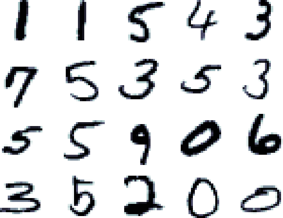

Boosting for Handwritten Digit Recognition 
=

Due: 7, April by 11:55pm

Overview
--------

In this homework you'll implement the AdaBoost classification
framework to take a drawing of a number and predict what number it
corresponds to.  Your implementation should be based on the description 
of AdaBoost given in the lecture slides.  

You'll turn in your code on Moodle.  This assignment is worth 30
points.

What you have to do
----

Coding (20 points):

1.  Modify the _fit_ function so that it trains and stores a sequence of weak learners via AdaBoost  
1.  Modify the _predict_ function to makes label predictions on unseen data 
1.  Modify the _score_ function to return the prediction accuracy on a labeled set of data 
1.  Modify the *staged_score* function to return an array of prediction scores corresponding to each boosting step 

Analysis (10 points):

1.  Use your AdaBoost code with Sklearn's DecisionTreeClassifier as the base learner to distinguish 4's from 9's (using the MNIST data from the KNN and SVM homeworks). 
1.  Run several hundred boosting iterations with trees of depths 1, 2, and 3 (go deeper if you like) as the weak learner.  Make plots of training and test error per boosting iteration and compare and contrast the different weak learners.  Which works the best?  Do you see signs of overfitting for any of the choices of depth?  Do any of classifiers achieve nearly 100% accuracy on the training data?  What happens to the accuracy on the test data on further iterations?    
1.  Try another classifier from Sklearn as the weak learner (e.g. a Perceptron) and repeat the steps above.  How does your choice of weak learner compare to decision trees?  

What to turn in
-

1.  Submit your _boost.py_ file
1.  Submit your _analysis.pdf_ file (no more than one page of text; pictures
    are better)

Unit Tests
-

We've provided unit tests based on the example shown in the lecture slides. 
  Before running your code on real data, make sure it passes
all of the unit tests.

 
Hints
-

1.  Don't use all of the data, especially at first.  You'll need to implement a _limit_ command-line argument to reduce the training set size. 
